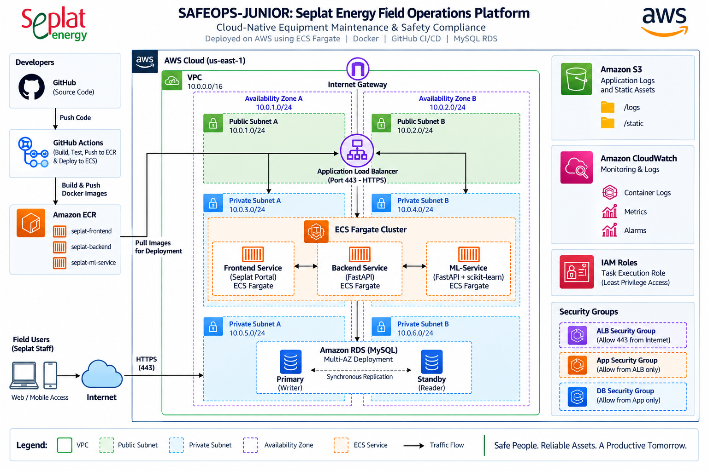

# SAFEOPS-JUNIOR
## Seplat Energy Field Operations Platform

> **Cloud-Native Equipment Maintenance & Safety Compliance Platform**

SAFEOPS-JUNIOR is a cloud-native field operations platform designed for oil and gas environments. The platform provides operational logging, equipment monitoring, maintenance risk analysis, and predictive failure detection through a containerized three-tier application deployed on AWS.

The solution combines **Docker, Amazon ECS Fargate, Amazon ECR, Application Load Balancer, Amazon RDS, Amazon S3, Amazon CloudWatch, IAM, VPC networking, and GitHub Actions** to provide a scalable and maintainable application platform for field operations.

---

## Architecture



### Architecture Overview

The platform is deployed inside an AWS VPC spanning two Availability Zones.

The architecture consists of:

- Public subnets hosting the Application Load Balancer
- Private subnets hosting ECS Fargate workloads
- Amazon ECS Fargate running three application services
- Amazon RDS for the application database
- Amazon ECR for container images
- Amazon S3 for application logs and static assets
- Amazon CloudWatch for container monitoring and logs
- IAM roles for controlled AWS access
- Security Groups separating the web, application, and database layers
- GitHub Actions for CI/CD automation

The architecture is designed around separation of responsibilities, private application workloads, controlled network access, and multi-AZ deployment.

---

# 1. Project Objectives

SAFEOPS-JUNIOR was developed to provide a centralized platform for monitoring and managing field equipment and operational activities.

### Key objectives

- Provide a centralized field operations portal
- Record daily production and operational metrics
- Manage equipment-related information
- Analyze equipment operating conditions
- Predict potential equipment failures
- Provide maintenance recommendations
- Containerize application workloads
- Deploy workloads using ECS Fargate
- Secure application and database communication
- Automate container image delivery through GitHub Actions
- Provide centralized application monitoring and logging

---

# 2. Application Components

SAFEOPS-JUNIOR consists of three primary application services.

## Frontend

The frontend provides the operational portal used by field personnel.

Responsibilities include:

- Operational data submission
- Equipment information
- Failure prediction interface
- Display of operational records
- Communication with backend and ML APIs

Technology:

- HTML
- CSS
- JavaScript
- Nginx
- Docker

---

## Backend API

The backend provides the main application API.

Responsibilities include:

- Production log management
- Equipment-related operations
- Database communication
- REST API endpoints
- Operational data retrieval

Technology:

- Python
- Flask
- PostgreSQL/MySQL database connectivity
- Docker
- Gunicorn

---

## ML Service

The ML service provides equipment failure prediction.

Responsibilities include:

- Receiving equipment sensor parameters
- Processing vibration and temperature values
- Calculating failure probability
- Determining whether downtime is imminent
- Providing maintenance recommendations

Technology:

- Python
- FastAPI
- scikit-learn
- Docker

Example prediction request:

```json
{
  "vibration_hz": 48,
  "temperature_celsius": 88
}
```

Example response:

```json
{
  "failure_probability": 0.832,
  "downtime_imminent": true,
  "recommendation": "Emergency Flush Protocol Required"
}
```

---

# 3. AWS Services

The project uses the following AWS services.

| Service | Purpose |
|---|---|
| Amazon VPC | Network isolation |
| Internet Gateway | Internet connectivity |
| Public Subnets | ALB placement |
| Private Subnets | Application and database workloads |
| Route Tables | Network traffic routing |
| NAT | Outbound connectivity for private workloads |
| Application Load Balancer | Application traffic distribution |
| Amazon ECS Fargate | Container execution |
| Amazon ECR | Docker image registry |
| Amazon RDS | Managed relational database |
| Amazon S3 | Logs and static assets |
| Amazon CloudWatch | Logs and monitoring |
| AWS IAM | Access control |
| Security Groups | Network-level security |
| GitHub | Source code repository |
| GitHub Actions | CI/CD automation |

---

# 4. AWS Network Architecture

The application is deployed inside a dedicated VPC.

```text
VPC
│
├── Availability Zone A
│   ├── Public Subnet A
│   └── Private Subnet A
│
└── Availability Zone B
    ├── Public Subnet B
    └── Private Subnet B
```

The network follows a layered architecture:

```text
Internet
    │
    ▼
Internet Gateway
    │
    ▼
Application Load Balancer
    │
    ▼
ECS Fargate Services
    │
    ▼
Database
```

The database is not directly exposed to the internet.

---

# 5. Application Traffic Flow

The primary application traffic flow is:

```text
Field User
    │
    │ HTTPS
    ▼
Internet
    │
    ▼
Application Load Balancer
    │
    ▼
Frontend Service
    │
    ├──────────────► Backend Service
    │                     │
    │                     ▼
    │                 RDS Database
    │
    └──────────────► ML Service
```

The Application Load Balancer provides the public entry point for the platform while ECS services remain inside private subnets.

---

# 6. Container Architecture

The application is containerized using Docker.

Three application containers are deployed:

```text
ECS Fargate Cluster
│
├── Frontend Service
│
├── Backend Service
│
└── ML Service
```

Each service is independently deployed as a containerized workload.

### Frontend

```text
frontend/
├── Dockerfile
├── app.js
└── index.html
```

### Backend

```text
backend/
├── Dockerfile
├── app.py
└── requirements.txt
```

### ML Service

```text
ml-service/
├── Dockerfile
├── app.py
└── requirements.txt
```

---

# 7. Amazon ECR

Amazon Elastic Container Registry stores the Docker images used by ECS.

The project maintains separate repositories for the application services:

```text
Amazon ECR
│
├── seplat-frontend
├── seplat-backend
└── seplat-ml-service
```

The deployment process is:

```text
Application Source Code
        │
        ▼
   GitHub Actions
        │
        ▼
    Docker Build
        │
        ▼
      Amazon ECR
        │
        ▼
   ECS Fargate
```

---

# 8. GitHub Actions CI/CD

GitHub Actions is used for application delivery automation.

The pipeline is responsible for:

1. Detecting code changes
2. Building Docker images
3. Authenticating with Amazon ECR
4. Tagging container images
5. Pushing images to ECR
6. Updating the ECS deployment

Pipeline flow:

```text
Developer
    │
    ▼
GitHub Repository
    │
    ▼
GitHub Actions
    │
    ├── Build
    ├── Test
    ├── Docker Build
    ├── ECR Authentication
    └── Push Images
            │
            ▼
        Amazon ECR
            │
            ▼
       ECS Fargate
```

---

# 9. Database Layer

The application uses a managed relational database deployed through Amazon RDS.

The database is placed inside private subnets and is not publicly accessible.

Database traffic follows:

```text
ECS Application
      │
      │ Database Connection
      ▼
Amazon RDS
```

The database layer is protected using a dedicated database Security Group.

Only authorized application workloads are allowed to communicate with the database.

---

# 10. Security Architecture

Security is implemented using multiple layers.

## Security Groups

The architecture separates traffic using dedicated Security Groups.

### ALB Security Group

Allows:

```text
Internet
   │
   ▼
ALB
```

Only the required public application traffic is permitted.

---

### Application Security Group

Allows traffic from the Application Load Balancer to ECS application services.

```text
ALB
 │
 ▼
ECS Services
```

Application workloads are not directly exposed to the public internet.

---

### Database Security Group

Allows database connections only from the application layer.

```text
ECS Services
     │
     ▼
RDS
```

There is no direct internet access to the database.

---

# 11. IAM

AWS IAM is used to control access to AWS resources.

The ECS workloads use IAM roles to obtain only the permissions required for their operation.

The architecture follows the principle of:

> **Least Privilege**

IAM permissions are designed to prevent application containers from receiving unnecessary AWS privileges.

---

# 12. Amazon S3

Amazon S3 is used for application storage requirements such as:

```text
Amazon S3
│
├── logs/
│
└── static/
```

The S3 layer provides durable object storage for application-related assets and logs.

---

# 13. Amazon CloudWatch

Amazon CloudWatch provides monitoring and centralized logging.

Container logs are sent to CloudWatch for operational visibility.

```text
ECS Fargate
│
├── Frontend Logs ──┐
├── Backend Logs ───┼──► CloudWatch
└── ML Logs ────────┘
```

CloudWatch can be used to investigate:

- Application errors
- Container failures
- Service health
- Deployment issues
- Runtime activity
- Operational events

---

# 14. Project Structure

```text
safeops-junior/
│
├── README.md
│
├── docker-compose.yml
│
├── frontend/
│   ├── Dockerfile
│   ├── index.html
│   └── app.js
│
├── backend/
│   ├── Dockerfile
│   ├── app.py
│   └── requirements.txt
│
├── ml-service/
│   ├── Dockerfile
│   ├── app.py
│   └── requirements.txt
│
└── terraform/
    ├── main.tf
    ├── variables.tf
    ├── outputs.tf
    ├── terraform.tfvars
    │
    └── modules/
        │
        ├── vpc/
        │   ├── main.tf
        │   ├── variables.tf
        │   └── outputs.tf
        │
        ├── security/
        │   ├── main.tf
        │   ├── variables.tf
        │   └── outputs.tf
        │
        ├── compute/
        │   ├── main.tf
        │   ├── variables.tf
        │   └── outputs.tf
        │
        └── database/
            ├── main.tf
            ├── variables.tf
            └── outputs.tf
```

---

# 15. Prerequisites

Before deploying the project, install and configure:

- Git
- Docker
- Docker Compose
- AWS CLI
- Terraform
- An AWS account
- GitHub account
- AWS IAM credentials with appropriate permissions

Verify the installations:

```bash
git --version
docker --version
docker compose version
aws --version
terraform version
```

---

# 16. Configure AWS CLI

Configure the AWS CLI:

```bash
aws configure
```

Provide:

```text
AWS Access Key ID
AWS Secret Access Key
Default region: us-east-1
Default output format: json
```

Verify the configuration:

```bash
aws sts get-caller-identity
```

---

# 17. Clone the Repository

Clone the project:

```bash
git clone <YOUR_GITHUB_REPOSITORY_URL>
```

Move into the project:

```bash
cd safeops-junior
```

---

# 18. Local Application Deployment

Before deploying to AWS, test the application locally.

Start the containers:

```bash
docker compose up --build
```

Check running containers:

```bash
docker ps
```

The local environment should contain:

```text
Frontend
Backend
ML Service
Database
```

To stop the application:

```bash
docker compose down
```

---

# 19. Build Docker Images

Build the frontend image:

```bash
docker build -t seplat-frontend ./frontend
```

Build the backend image:

```bash
docker build -t seplat-backend ./backend
```

Build the ML service image:

```bash
docker build -t seplat-ml-service ./ml-service
```

Verify the images:

```bash
docker images
```

---

# 20. Terraform Deployment

Move into the Terraform directory:

```bash
cd terraform
```

Initialize Terraform:

```bash
terraform init
```

Validate the configuration:

```bash
terraform validate
```

Format the Terraform configuration:

```bash
terraform fmt -recursive
```

Review the deployment plan:

```bash
terraform plan
```

Deploy the infrastructure:

```bash
terraform apply
```

Confirm the deployment:

```text
yes
```

Terraform provisions the required infrastructure defined by the project.

---

# 21. Terraform Outputs

After deployment, retrieve the Terraform outputs:

```bash
terraform output
```

The application public endpoint can be obtained from the Terraform output.

Example:

```text
application_public_url = "http://<ALB-DNS-NAME>"
```

Open the ALB URL in a web browser to access the application.

---

# 22. Verify ECS Services

Check the ECS cluster:

```bash
aws ecs describe-services \
  --cluster seplat-cluster \
  --services \
  seplat-frontend-service \
  seplat-backend-service \
  seplat-ml-service-service \
  --region us-east-1 \
  --query 'services[*].[serviceName,desiredCount,runningCount,status]' \
  --output table
```

Expected result:

```text
Service                     Desired   Running   Status
-------------------------------------------------------
seplat-frontend-service       1         1       ACTIVE
seplat-backend-service        1         1       ACTIVE
seplat-ml-service-service     1         1       ACTIVE
```

---

# 23. Verify Application Load Balancer

Retrieve the ALB DNS name:

```bash
aws elbv2 describe-load-balancers \
  --region us-east-1 \
  --query 'LoadBalancers[*].[LoadBalancerName,DNSName,State.Code]' \
  --output table
```

Test the application:

```bash
curl -i http://<ALB-DNS-NAME>
```

A successful response should return the frontend HTML page.

---

# 24. Verify Backend API

Test the backend health endpoint:

```bash
curl -i http://<ALB-DNS-NAME>/api/v1/health
```

Expected response:

```json
{
  "status": "healthy",
  "service": "seplat-backend"
}
```

---

# 25. Verify ML Prediction Service

The ML service accepts equipment sensor measurements.

Example:

```bash
curl -i \
  -X POST \
  http://<ALB-DNS-NAME>/api/ml/predict \
  -H "Content-Type: application/json" \
  -d '{"vibration_hz":48,"temperature_celsius":88}'
```

Example response:

```json
{
  "failure_probability": 0.832,
  "downtime_imminent": true,
  "recommendation": "Emergency Flush Protocol Required"
}
```

---

# 26. Verify Production Log Submission

Operational metrics can be submitted through the application interface.

Example payload:

```json
{
  "asset_name": "OML-4",
  "barrels_per_day": 12500,
  "pressure_psi": 420
}
```

The backend stores the submitted operational information in the database.

---

# 27. Verify Container Images in ECR

List the available ECR repositories:

```bash
aws ecr describe-repositories \
  --region us-east-1 \
  --output table
```

Check the frontend repository:

```bash
aws ecr list-images \
  --repository-name seplat-frontend \
  --region us-east-1 \
  --output table
```

Check the backend repository:

```bash
aws ecr list-images \
  --repository-name seplat-backend \
  --region us-east-1 \
  --output table
```

Check the ML repository:

```bash
aws ecr list-images \
  --repository-name seplat-ml-service \
  --region us-east-1 \
  --output table
```

---

# 28. GitHub Actions Deployment

After the application has been configured for GitHub Actions, push changes to GitHub:

```bash
git add .
git commit -m "Update SAFEOPS-JUNIOR application"
git push origin main
```

GitHub Actions can then:

```text
Git Push
   │
   ▼
GitHub Actions
   │
   ├── Build
   ├── Test
   ├── Docker Build
   ├── Authenticate with ECR
   ├── Push Images
   └── Deploy to ECS
```

---

# 29. Updating the Application

When application source code changes:

```bash
git add .
git commit -m "Update application"
git push origin main
```

The CI/CD workflow handles the image build and deployment process.

For infrastructure changes:

```bash
cd terraform

terraform plan

terraform apply
```

---

# 30. Monitoring

Application workloads should be monitored through Amazon CloudWatch.

Recommended monitoring areas include:

- ECS service health
- Running task count
- Container logs
- Application errors
- ALB request activity
- Database availability
- Infrastructure events

CloudWatch provides the central operational view of the deployed workloads.

---

# 31. Troubleshooting

## ECS Service Running but Application Returns 503

Check ECS:

```bash
aws ecs describe-services \
  --cluster seplat-cluster \
  --services seplat-frontend-service \
  --region us-east-1
```

Check the target group:

```bash
aws elbv2 describe-target-health \
  --target-group-arn <TARGET_GROUP_ARN> \
  --region us-east-1
```

The target should show:

```text
State: healthy
```

---

## Application Returns 404

Verify the requested API endpoint.

For backend health:

```text
/api/v1/health
```

For operational records:

```text
/api/v1/operations
```

For ML prediction:

```text
/api/ml/predict
```

Ensure the frontend API paths match the backend and ML service routes.

---

## ML Prediction Returns 422

Ensure the request uses the expected field names:

```json
{
  "vibration_hz": 48,
  "temperature_celsius": 88
}
```

Do not use:

```json
{
  "vibration": 48,
  "temperature": 88
}
```

---

## ECS Tasks Fail to Start

Check ECS task logs and CloudWatch.

Verify:

- ECR image exists
- ECS task definition references the correct image
- IAM permissions are correct
- Environment variables are configured
- Security Groups allow required communication
- Container ports match the target groups

---

# 32. Infrastructure Destruction

To remove the infrastructure created by Terraform:

```bash
cd terraform
terraform destroy
```

Review the resources Terraform intends to remove and confirm:

```text
yes
```

This removes the infrastructure managed by the Terraform configuration.

The Docker source code and Terraform configuration remain in the GitHub repository.

---

# 33. Recreating the Infrastructure

The infrastructure can be recreated later from the Terraform configuration.

Initialize Terraform if necessary:

```bash
terraform init
```

Review the plan:

```bash
terraform plan
```

Deploy again:

```bash
terraform apply
```

After deployment, retrieve the new application endpoint:

```bash
terraform output
```

The ALB DNS name may change after the infrastructure is destroyed and recreated.

---

# 34. Security Principles

SAFEOPS-JUNIOR follows several cloud security principles:

### Network Isolation

Application workloads are deployed in private subnets.

### No Public Database

The RDS database is not directly exposed to the internet.

### Security Group Segmentation

Traffic is separated between:

```text
Internet
   │
   ▼
ALB Security Group
   │
   ▼
Application Security Group
   │
   ▼
Database Security Group
```

### Least Privilege

IAM roles are used to provide only the permissions required by workloads.

### Containerized Deployment

Application components are packaged as Docker containers and deployed through ECS Fargate.

---

# 35. High Availability

The infrastructure spans two Availability Zones.

```text
                 AWS VPC
                    │
          ┌─────────┴─────────┐
          │                   │
       AZ-A                 AZ-B
          │                   │
    Public Subnet        Public Subnet
          │                   │
          └─────── ALB ───────┘
                    │
          ┌─────────┴─────────┐
          │                   │
     Private Subnet      Private Subnet
          │                   │
       ECS Tasks           ECS Tasks
          │                   │
          └─────────┬─────────┘
                    │
                RDS Layer
```

This architecture provides infrastructure redundancy across Availability Zones.

---

# 36. Technology Stack

### Application

- HTML
- CSS
- JavaScript
- Python
- Flask
- FastAPI
- scikit-learn

### Containers

- Docker
- Docker Compose
- Amazon ECR
- Amazon ECS Fargate

### AWS Infrastructure

- Amazon VPC
- Internet Gateway
- NAT
- Application Load Balancer
- Amazon ECS
- Amazon ECR
- Amazon RDS
- Amazon S3
- Amazon CloudWatch
- AWS IAM
- Security Groups

### Infrastructure as Code

- Terraform

### CI/CD

- GitHub
- GitHub Actions

---

# 37. Engineering Principles

SAFEOPS-JUNIOR was designed around the following principles:

- Infrastructure as Code
- Containerized workloads
- Private application networking
- Security Group segmentation
- Least-privilege IAM
- Multi-AZ architecture
- Managed database services
- Centralized logging
- Automated container delivery
- Separation of application services
- Operational visibility

---

# 38. Project Outcome

SAFEOPS-JUNIOR demonstrates the implementation of a production-oriented cloud architecture for an oil and gas field operations environment.

The project combines application development, containerization, networking, security, infrastructure automation, database services, CI/CD, and operational monitoring into a single AWS-based platform.

The resulting platform provides a foundation for:

- Field operational monitoring
- Equipment maintenance management
- Safety compliance
- Predictive equipment analysis
- Containerized cloud deployment
- Automated application delivery
- Scalable AWS infrastructure

---

# 39. Project Summary

```text
                     SAFEOPS-JUNIOR
                           │
                 Seplat Energy Operations
                           │
              ┌────────────┴────────────┐
              │                         │
          Field Users              GitHub
              │                         │
              ▼                         ▼
          Internet                GitHub Actions
              │                         │
              ▼                         ▼
             ALB                     ECR
              │                         │
              └────────────┬────────────┘
                           │
                    ECS Fargate
                           │
             ┌─────────────┼─────────────┐
             │             │             │
          Frontend      Backend       ML Service
             │             │             │
             │             ▼             │
             │          RDS Database     │
             │                           │
             └─────────────┬─────────────┘
                           │
                      CloudWatch
                           │
                         Logs
```

---

## SAFEOPS-JUNIOR

**Seplat Energy Field Operations Platform**

> **Safe People. Reliable Assets. A Productive Tomorrow.**
````
